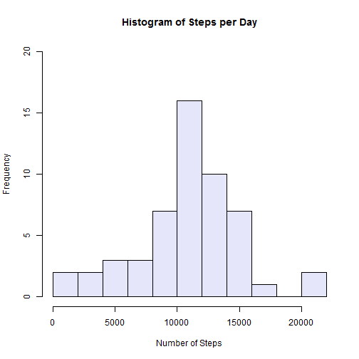
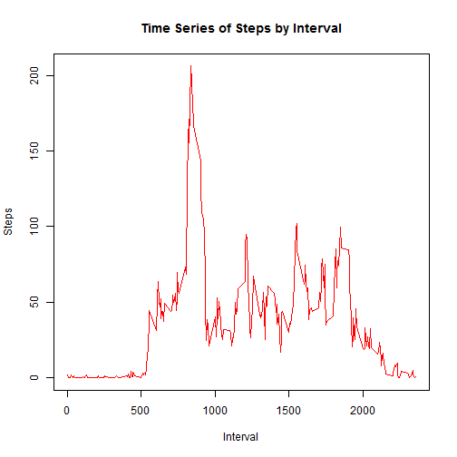
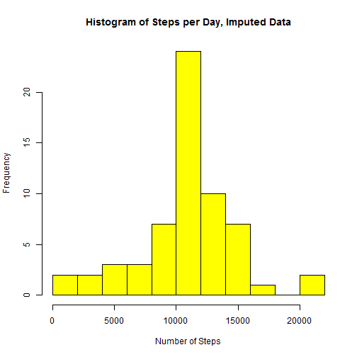

# Loading and preprocessing the data 
## 1. Loading the data
This markdown file was created using R Studio, Version 0.99.463, on Windows 10, 64-bit.

To begin, I: 
1. downloaded the data to our working directory; 
2. removed the download URL fromour workspace; 
3. loaded the `data.table` library, and finally; 
4. read the `activity.csv` file into R.  

```r
fileUrl <- "https://d396qusza40orc.cloudfront.net/repdata%2Fdata%2Factivity.zip"
rm(fileUrl)
library(data.table)
activity <- read.table("./activity.csv", colClasses = "character", sep = ",",
                       header = TRUE, na.strings = NA) 
head(activity, n = 3)
```

```
##   steps       date interval
## 1  <NA> 2012-10-01        0
## 2  <NA> 2012-10-01        5
## 3  <NA> 2012-10-01       10
```

```r
str(activity)
```

```
## 'data.frame':	17568 obs. of  3 variables:
##  $ steps   : chr  NA NA NA NA ...
##  $ date    : chr  "2012-10-01" "2012-10-01" "2012-10-01" "2012-10-01" ...
##  $ interval: chr  "0" "5" "10" "15" ...
```
## 2. Preprocessing the data
The `activity` data.frame needs minimal preprocessing to start the assignment. I initially, I converted: 

1. `activity$interval` and `activity$steps` into integer class variables; 
2. `activity$date` into a POSIXlt class variable using the `strptime()` function in `lubridate`; 
3. `activity$date` into a POSIXct class variable using `as.POSIXct()`. 


```r
activity$interval <- as.integer(activity$interval)
activity$steps <- as.integer(activity$steps)

library(lubridate)
activity$date <- strptime(activity$date, "%Y-%m-%d")
activity$date <- as.POSIXct(activity$date)
str(activity)
```

```
## 'data.frame':	17568 obs. of  3 variables:
##  $ steps   : int  NA NA NA NA NA NA NA NA NA NA ...
##  $ date    : POSIXct, format: "2012-10-01" "2012-10-01" ...
##  $ interval: int  0 5 10 15 20 25 30 35 40 45 ...
```
Since I completed all the conversion on the `activity` dataset, variables from any subsequent datasets will retain this same initial structure.

# What is mean total number of steps taken per day?
## 1. Calculate the total number of steps per day
To calculate the total number of steps per day, I calculated the number of steps per day using `aggregate()` and created a new `data.frame` called `ds.agg`.

```r
ds.agg <- aggregate(list(steps = activity$steps), 
                    by=list(date = activity$date), sum)
head(ds.agg, n = 3)
```

```
##         date steps
## 1 2012-10-01    NA
## 2 2012-10-02   126
## 3 2012-10-03 11352
```

```r
str(ds.agg)
```

```
## 'data.frame':	61 obs. of  2 variables:
##  $ date : POSIXct, format: "2012-10-01" "2012-10-02" ...
##  $ steps: int  NA 126 11352 12116 13294 15420 11015 NA 12811 9900 ...
```

## 2. Histogram
I used the the `hist()` function in base R to create a histogram of the number of steps per day. To show more detail than the default settings permitted, I increased the number of bins (`breaks`) to 10 from the default, which on my system was five bins for this histogram. I set the `ylim` option at 0 to 20 to mirror the histogram produced using the imputed data (which appears later in the assignment). 


```r
hist(ds.agg$steps, freq = TRUE, xlab = "Number of Steps", ylab = "Frequency",
     main = "Histogram of Steps per Day", breaks = 10, col = "lavender", 
     ylim = c(0,20))
```

 

The histogram appears to be just slightly left skewed, but is otherwise hill-shaped, there is one peak (the visual representation of the mode) which appears nearly in the center of the diagram), and there are few outliers.  

## 3. Calculate and report the mean and median steps per day
I calculated the mean and median number of steps per day using the `mean()` and `median()` functions (respectively). I have shown the calculations with and without the `na.rm = TRUE` option on both functions. The `na.rm = TRUE` option tells R to ignore the missing values.  

```r
mean(ds.agg$steps)
```

```
## [1] NA
```

```r
median(ds.agg$steps)
```

```
## [1] NA
```

```r
mean(ds.agg$steps, na.rm = TRUE)
```

```
## [1] 10766.19
```

```r
median(ds.agg$steps, na.rm = TRUE)
```

```
## [1] 10765
```
As we can see in the first two functions, where `na.rm = FALSE` (the default setting), R simply produces `NA` as the output, since it cannot calculate the mean or mode when there are missing values present. 

As found in the calculations where `na.rm = TRUE`, the mean number of steps per day is 10766.19, while the median number of steps per day is 10765. This means that both the arithmetic average and the middle value in the distribution are almost the same -- a differece of only 1.19 steps between the mean and median number of steps per day. 

# What is the average daily activity pattern?
## 1. Time series plot
To prepare for the time series plot, I first need to aggregate the data to determine the mean number of steps in each interval across all days. I will use the `aggregate()` function to prepare for the time series chart. Then, I can produce the time series chart.

```r
int.agg <- aggregate(steps ~ interval, data = activity, mean)
head(int.agg, n = 3)
```

```
##   interval     steps
## 1        0 1.7169811
## 2        5 0.3396226
## 3       10 0.1320755
```

```r
plot(int.agg$interval, int.agg$steps, type = "l", col = "red",
     ylab = "Steps", xlab = "Interval", 
     main = "Time Series of Steps by Interval")
```

 

The point with the highest number of steps in the interval appears to occur near the 750 (or, 7:50am) interval -- which is halfway between the labeled 500 and 1000 intervals. 

## 2. Maximum 5-minute interval
To find the interval with the maximum number of steps, I employed `which.max` in a subset call. I also could have simply used the `summary()` function, but this produces unnecessary output. 

```r
int.agg[which.max(int.agg$steps),]
```

```
##     interval    steps
## 104      835 206.1698
```
The five minute interval with the greatest numbr of steps is 835, or 8:35am. This finding is consistent with a visual inspection of time series chart. 

# Imputing missing values
## 1. Report Number of Missing Rows
The original `activity` data set has 17,568 rows and 3 columns (17568, 3). To determine the number of rows with missing data, I will use the `sum` function along with the `is.na` function on the dataset, which will tell me the number of missing cases in the dataset: 

```r
sum(is.na(activity))
```

```
## [1] 2304
```
As we can see, there are 2,304 cases with missing values -- meaning, 2,304 five-minute intervals did not include the number of steps taken during the interval.

## 2. Median Imputation by Interval
For this simple imputation exercise, I decided to impute the mean value of the interval to replace missing values. In a real-life situation, a complicated multiple imputation procedure would have been used, but for the purpose of the class and per the instructions, I used a simpler protocol. 

To complete the imputation, I: 
1. created a general function to calculate the mean and then replace missing values with the mean; 
2. created a new dataset called `imputed` that calculates the mean number of steps by interval, replacing the missing values. This step requires the `plyr` function; 
3. sort the `imputed` dataset by interval and then date. 


```r
mean.calc <- function(x) replace(x, is.na(x), mean(x, na.rm = TRUE))
library(plyr)
imputed <- ddply(activity, ~ interval, transform, steps = mean.calc(steps))
head(imputed, n = 3)
```

```
##      steps       date interval
## 1 1.716981 2012-10-01        0
## 2 0.000000 2012-10-02        0
## 3 0.000000 2012-10-03        0
```

## 3. Histogram and mean / median calculations with imputed data

To create a histogram using the imputed data, I had to `aggregate()` the total number of steps per day to a new dataset called `imputed.day`. 


```r
imputed.day <- aggregate(list(steps = imputed$steps), 
                         by=list(date = imputed$date), sum)
head(imputed.day, n = 3)
```

```
##         date    steps
## 1 2012-10-01 10766.19
## 2 2012-10-02   126.00
## 3 2012-10-03 11352.00
```

```r
str(imputed.day)
```

```
## 'data.frame':	61 obs. of  2 variables:
##  $ date : POSIXct, format: "2012-10-01" "2012-10-02" ...
##  $ steps: num  10766 126 11352 12116 13294 ...
```

Notice that the structure of the `imputed.day` dataset is identical to the `ds.agg` dataset from earlier. Next, I used the `hist()` function to produce the histogram using the `imputed.day` data. I retained the same number of bins as in the previous histogram. 


```r
hist(imputed.day$steps, freq = TRUE, xlab = "Number of Steps", ylab = "Frequency",
     main = "Histogram of Steps per Day, Imputed Data", breaks = 10, col = "yellow")
```

 

Visually, the histogram with the imputed data looks quite similar to the histogram created earlier with the `ds.agg` data. Both appear to be slightly skewed, have outliers greater than 20000 steps per day, and retain a mostly normal appearance. In the `imputed.day` histogram, the frequency of center values (the mean, median, and mode) is greater, but this is likely because more than 2000 additional interval values are included to calculate the number of steps per day. By adding the 

Finally, I calculated the mean and median number of steps per day with the `imputed.day` data. Since there are no missing values, I did not include the `na.rm = TRUE` option. 


```r
mean(imputed.day$steps)
```

```
## [1] 10766.19
```

```r
median(imputed.day$steps)
```

```
## [1] 10766.19
```

With the imputed data, the `mean` and `median` number of steps per day are both 10766.19, which is identical to the mean number of steps produced using the `ds.agg` data, while removing missing cases. 

# Are there differences in activity patterns between weekdays and weekends?
## New weekday / weekend factor variable 

To create the weekday / weekend factor variable, I: 
1. created a new variable named `wday` on the `imputed` dataset to report the day of the week of each observation, using the `weekdays()` function; 
2. transformed the new `wday` character variable to a factor variable; 
3. used the `revalue()` function from `plyr` to rename the days of the week to `weekday` and `weekend`. 


```r
imputed$wday <- weekdays(imputed$date, abbreviate = TRUE)
str(imputed)
```

```
## 'data.frame':	17568 obs. of  4 variables:
##  $ steps   : num  1.72 0 0 47 0 ...
##  $ date    : POSIXct, format: "2012-10-01" "2012-10-02" ...
##  $ interval: int  0 0 0 0 0 0 0 0 0 0 ...
##  $ wday    : chr  "Mon" "Tue" "Wed" "Thu" ...
```

```r
imputed$wday <- as.factor(imputed$wday)
imputed$wday <- revalue(imputed$wday, c("Mon" = "weekday", "Tue" = "weekday", 
                                        "Wed" = "weekday", "Thu" = "weekday", 
                                        "Fri" = "weekday", "Sat" = "weekend", 
                                        "Sun" = "weekend"))
str(imputed)
```

```
## 'data.frame':	17568 obs. of  4 variables:
##  $ steps   : num  1.72 0 0 47 0 ...
##  $ date    : POSIXct, format: "2012-10-01" "2012-10-02" ...
##  $ interval: int  0 0 0 0 0 0 0 0 0 0 ...
##  $ wday    : Factor w/ 2 levels "weekday","weekend": 1 1 1 1 1 2 2 1 1 1 ...
```

```r
head(imputed, n = 3)
```

```
##      steps       date interval    wday
## 1 1.716981 2012-10-01        0 weekday
## 2 0.000000 2012-10-02        0 weekday
## 3 0.000000 2012-10-03        0 weekday
```

## Panel plot 
To create the panel plot, I tidied the `imputed` dataset to find the average number of steps per interval across the dataset, for both weekend days and weekdays. 


```r
imp.wday <- aggregate(steps ~ interval + wday, data = imputed, mean)
head(imp.wday, n = 3)
```

```
##   interval    wday     steps
## 1        0 weekday 2.2511530
## 2        5 weekday 0.4452830
## 3       10 weekday 0.1731656
```

```r
str(imp.wday)
```

```
## 'data.frame':	576 obs. of  3 variables:
##  $ interval: int  0 5 10 15 20 25 30 35 40 45 ...
##  $ wday    : Factor w/ 2 levels "weekday","weekend": 1 1 1 1 1 1 1 1 1 1 ...
##  $ steps   : num  2.251 0.445 0.173 0.198 0.099 ...
```

Even though the original example ploto used the R-package `lattice`, the instructions permitted other packages, so I decided to use `ggplot2` to create the panel plot.


```r
library(ggplot2)
g <- ggplot(imp.wday, aes(interval, steps))
g + geom_line(stat = "identity", binwidth = 1) + facet_wrap(~ wday, nrow = 2)
```

 

There does appear to be a difference in the activity patterns between weekends and weekdays. On weekdays, there is a spike in activity between 7:50am and 10:00am, where the most activity exceeds an average of 250 steps, then a sharp decrease in activity after 10:00am, with intermittent increases throughout the day. On weekends, there are increases and decreases in activity throughout the day, but in no case does mean activity exceed 175 steps on average. The activity throughout the day on weekends appears more constant than on weekdays. 
knit2html("PA1_template.Rmd")
